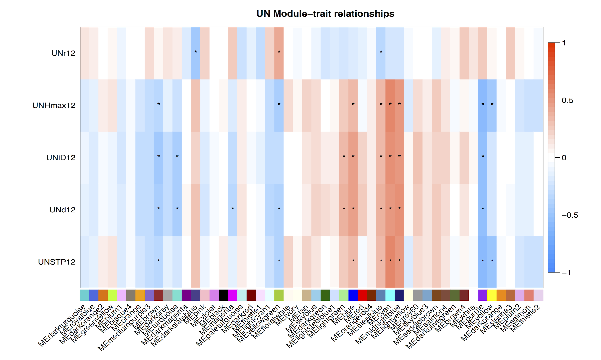
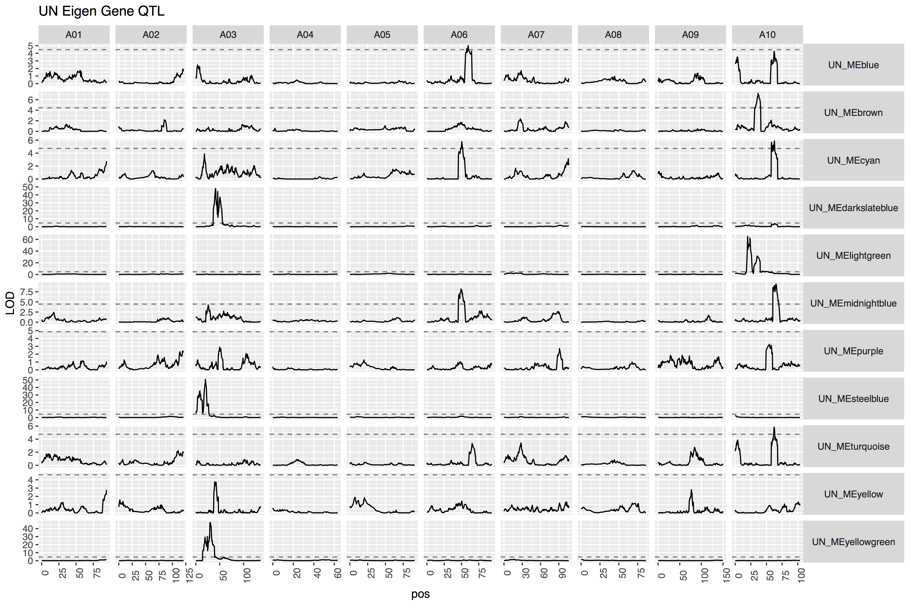

```{r setup, include=FALSE}
knitr::opts_chunk$set(echo = FALSE, cache = TRUE, autodep = TRUE)
```

```{r getdata, include=FALSE}
library(tidyverse)
library(knitr)
library(limma)
library(snowfall)
library(igraph)

load("../output/MR_UN.Rdata")
annotation <- read.csv("../input/Brapa_V1.5_annotated.csv",row.names=1,as.is = TRUE)
```

```{r mr_subgraphs, echo=FALSE, cache.lazy=FALSE, warning=FALSE, eval=TRUE }
get.mr.subgraph <- function(mr.cutoff,mr.matrix,annotation=NULL,neighborhood,order=1) {
  #function to extract graph at a specificed correlation cutoff
  gene.mr.tmp <- mr.matrix
  gene.mr.tmp[abs(gene.mr.tmp) > mr.cutoff] <- 0
  gene.mr.tmp[is.na(gene.mr.tmp)] <- 0 #important! otherwise vertices with NA edges are connected
  
  gene.graph <- graph.adjacency(adjmatrix = gene.mr.tmp,
                                mode="undirected",
                                weighted="mr",
                                diag=FALSE)
  
  sub.graphs <- graph.neighborhood(gene.graph,order=order,nodes=neighborhood) #for each node of interest get all other nodes within order of 1
  
  #get combined list of vertices...
  
  sub.vertices <- unique(names(unlist(lapply(sub.graphs, V))))
  
  combined.sub.graph <- induced_subgraph(gene.graph,sub.vertices)
  
  V(combined.sub.graph)$color <- "lightblue"
  V(combined.sub.graph)[neighborhood]$color <- "red"
  if(!is.null(annotation)) V(combined.sub.graph)$gene <- 
    annotation$At_symbol[match(V(combined.sub.graph)$name,annotation$name)]
  list(cutoff=mr.cutoff,graph=combined.sub.graph,nodes=V(combined.sub.graph)$name)
}
```

```{r, echo=FALSE, eval=TRUE}
cutoffs <- c(10,20,30,50)

blup.mr.graphs.UN.2012 <- lapply(cutoffs, get.mr.subgraph, mr.matrix = expr.blup.mr.UN.2012, annotation= annotation, neighborhood = colnames(blups.UN) %>% str_subset("12"))
names(blup.mr.graphs.UN.2012) <- sapply(blup.mr.graphs.UN.2012, function(x) paste("blup.mr.graph.UN.2012",x$cutoff,sep="."))
```

```{r}
edge.col.sign <- function(graph,edge.colors) {#color edges by correlation sign
  E(graph) %>% 
    attr("vnames") %>% 
    tibble(edge=.) %>% 
    separate(edge,into=c("node1","node2"),remove = FALSE,sep="\\|") %>%
    rowwise() %>% 
    mutate(cor=expr.blup.cor.UN[node1,node2],
           col=ifelse(cor > 0, edge.colors[1], edge.colors[2])) %>%
    select(col) %>%
    unlist()
}
```

```{r plot.function}
plot.graph <- function (blup.graph) {
    E(blup.graph$graph)$width <- rank(E(blup.graph$graph)$mr)^(1/4)
    E(blup.graph$graph)$color <- edge.col.sign(blup.graph$graph, edge.colors=c("magenta","green"))
    plot(blup.graph$graph,
         layout = layout_with_kk, 
         vertex.label = ifelse(is.na(V(blup.graph$graph)$gene)|V(blup.graph$graph)$gene=="",
                               V(blup.graph$graph)$name,
                               paste(V(blup.graph$graph)$gene,V(blup.graph$graph)$name,sep="\n")),
         vertex.label.cex=1,
         main=paste("MR cutoff =",sub("blup.mr.graph.","",blup.graph$cutoff,fixed=T)))
    rm(blup.graph)
}
```


# Intro

## Background

* Goal: find genes & networks connected to _B. rapa_ growth
* Rob Baker, Cynthia Weinig, Steve Welch, etc collected growth data on _B. rapa_ RIL set in field setting.
* Growth functions were fitted for each line.
* We have gene expression for the same lines.
* Are there genes whose expression is associated with growth?
* Can they help explain growth variation between lines?

## Approach

* Use Mutual Rank co-expression networks:
  * For each growth trait, build a network of genes that have a similar pattern across the RILs
  * In this case, look for association by mutual rank (MR) (next slide)
* Alternatively use WGCNA:
  * Build WGCNA co-expression network independent of growth traits
  * Then look for correlation between network module Eigen genes and growth traits

# Mutual Rank

## Basic idea of Mutual Rank

1. Build a correlation matrix of gene expression and trait values
2. For each gene or trait, rank its correlations with the other genes and traits.  The gene with the highest correlation gets rank 1, etc.
3. For each gene x gene, gene x trait, or trait x trait pair, calculate the geometric average.  This is the mutual rank.
4. Look at the network of genes (and traits) around each trait.
5. Determine significance by permutation.

## Starting data

```{r}
expr.blup.UN <- expr.blup.UN %>% select(-matches("^UN.*11$"))

knitr::kable(expr.blup.UN[1:10,1:10],digits=c(1,4,rep(1,8)))
```


## Build correlation matrix

```{r}
knitr::kable(cor(expr.blup.UN[,2:10]),digits=2)
```

## Calculate mutual ranks

```{r}
knitr::kable(expr.blup.mr.UN.2012[1:10,1:10],digits=0)
```


## What do we get?

## MR < 20

```{r}
plot.graph(blup.graph = blup.mr.graphs.UN.2012[[2]])
```

## MR < 30

```{r}
plot.graph(blup.graph = blup.mr.graphs.UN.2012[[3]])
```

## MR < 50

```{r}
plot.graph(blup.graph = blup.mr.graphs.UN.2012[[4]])
```


## Significance thresholds

* Randomize traits relative to gene expression
* Make a graph, count # of connections
* Repeat 100 times
* Calculate 95th percentile # of connections
* You would expect fewer than this number 95% of the time in random data

## Significance thresholds

```{r, eval=FALSE, echo=FALSE}
sapply(blup.mr.graphs.CR,function(graph) sum(grepl("^Bra",graph$nodes)))
```


|*MR Threshold*|*95th percentile expectation *|*Observed*
|---------|----------|----------|
| 10 | 0 | 1 |
| 20 | 0 | 13 |
| 30 | 0 | 28 |
| 50 | 0 | 57 |

So the networks are enriched for "real" connections

## Candidates from UN condition

* ATMES10:	Methyl jasmonate esterase activity; increases JA.  Negatively correlated with growth and final height.
* AtAAS: Induced by JA.  Positively correlated with growth (strange...)
* ENH1: Enhancer of Salt Over Sensitive.  Negatively correlated.
* BEL1: interacts with STM and KNAT1.  Required for ovule specification, but could be more general growth regulator.  Restricts WUS expression.  Negatively correlated with growth.
* LPPEPSILON 2: lipid phosphatidic acid phosphatase.  In chlroplast
* LBD37: LOB domain containing protein.  Nitrogen Metabolism.  Negatively correlated with growth.

## MR genes and growth QTL

Do any of the the MR genes co-localize with QTL peaks for growth?

Yes!

| MR Cutoff | Network Genes | Network Genes under QTL | P-Value for enrichment
|-----------|-------|-----------------|-----------------------
| 10 | 1  | 0  | 1
| 20 | 13 | 9  | 6.9 E-13
| 30 | 28 | 9  | 5.0 E-09
| 50 | 57 | 21 | 9.9 E-21

Caveat: Linkage...

## Could any of these be causal?

Null hypothesis: Causal QTL and expression QTL for MR genes are genetically linked by not causally linked

Alternative: Causal QTL and expression QTL are the same gene.

Test:

$$
growth \sim QTL\_marker\tag{1}
\\ 
\\ VS
$$
$$
\\growth \sim QTL\_marker + gene\_expression\tag{2}
$$

Model 2 is favored (AIC -1702 vs -1814)

# WGCNA

## Basic idea

* WGCNA is an alternative method for reconstructing genetic networks
* Also based on gene co-expression
* Use a 'soft threshold' to build a network that approximates scale-free topology
* For my network I did NOT include growth trait info.

## Correlation with traits

After reconstructing the network, calculate the Eigen gene for each module and then correlate with traits:



## GO enrichment of correlated modules

Blue: Cell division (pos correlation)

```{r, include=FALSE}
GO <- read_csv("../output/SupTable_JM5_WGCNA_UN_GO_2012.csv",col_names = c("module","term","ontology","FDR","P","ID","underP","observed","total"))
GO <- GO %>% select(module, term, ontology, FDR)
```

```{r, echo=FALSE}
GO %>% filter(module=="blue", ontology=="BP") %>% knitr::kable()
```

## GO enrichment of correlated modules

Cyan: Translation (pos correlation)

```{r, echo=FALSE}
GO %>% filter(module=="cyan") %>% knitr::kable()
```

## GO enrichment of correlated modules

MidnightBlue: Stress/defense? (pos correlation)

```{r, echo=FALSE}
GO %>% filter(module=="midnightblue") %>% knitr::kable()
```

## GO enrichment of correlated modules

Brown: ? (neg correlation)

```{r, echo=FALSE}
GO %>% filter(module=="brown") %>% knitr::kable()
```

## Module Eigen gene eQTL

What regions of the genome controls expression of these modules?



## eQTL / trait QTL overlap

Do any of the module eQTL overlap with growth trait QTL?

Yes, there are two regions that overlap.  p < 0.001.

A10 (cyan, midnightblue, blue); A03 (darkslateblue)


# Summary

## Summary

Network analysis has defined possible mechanisms underlying growth trait QTL.


